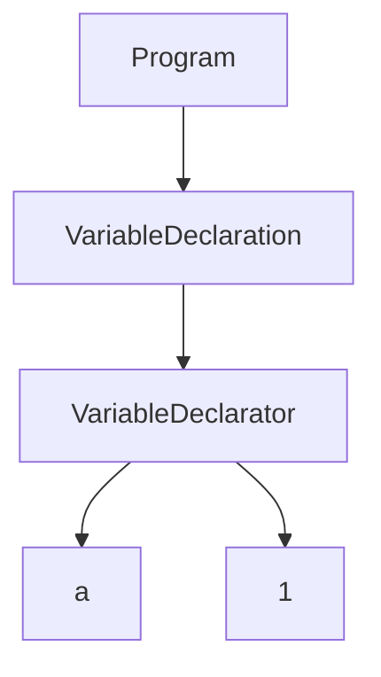

---
# try also 'default' to start simple
theme: seriph
# random image from a curated Unsplash collection by Anthony
# like them? see https://unsplash.com/collections/94734566/slidev
background: https://source.unsplash.com/collection/94734566/1920x1080
# apply any windi css classes to the current slide
class: 'text-center'
# https://sli.dev/custom/highlighters.html
highlighter: shiki
# show line numbers in code blocks
lineNumbers: false
# some information about the slides, markdown enabled
info: |
  ## Slidev Starter Template
  Presentation slides for developers.

  Learn more at [Sli.dev](https://sli.dev)
# persist drawings in exports and build
drawings:
  persist: false
# page transition
transition: slide-left
# use UnoCSS
css: unocss
---

# 浅谈前端 AST 的原理及应用

<div class="pt-12">
  <span @click="$slidev.nav.next" class="px-2 py-1 rounded cursor-pointer" hover="bg-white bg-opacity-10">
    Press Space for next page <carbon:arrow-right class="inline"/>
  </span>
</div>

<div class="abs-br m-6 flex items-center gap-2">
  <button @click="$slidev.nav.openInEditor()" title="Open in Editor" class="text-xl slidev-icon-btn opacity-50 !border-none !hover:text-white">
    <carbon:edit />
  </button>
  分享人：韦帆
</div>

<!--
The last comment block of each slide will be treated as slide notes. It will be visible and editable in Presenter Mode along with the slide. [Read more in the docs](https://sli.dev/guide/syntax.html#notes)
-->

---
transition: slide-down
---

# 好奇心

- `IDE` 中错误提示，自动补全，代码高亮如何实现的？
- 代码压缩混淆如何实现的?
- `vue` 的 `sfc` 如何编译成浏览器认识的 `js` 的？
- `eslint`，`prettier` 如何实现的？
- `bable` 是怎么工作的？
- 各种规范之前如何互转的？`cjs-umd-amd-esm`
- `coffeeScript`，`typeScript`，`jsx` 等如何转换为原生 `js` 的？
- `less`，`sass`，`postcss` 等各种前置后置 `css` 处理器如何工作的？
- `webpack`，`rollup` 等各种打包器如何工作的？
- ...


---
transition: fade-out
---

# 什么是 AST ?

话不多说上图 [在线解析 AST](https://astexplorer.net/)


<div
  style="top:30%;left:10%;width:38%;"
  v-click=1
  class="absolute"
  v-motion
  :initial="{ x: -80, opacity: 0}"
  :enter="{ x: 0, opacity: 1, transition: { delay: 2000, duration: 1000 } }">
  抽象语法树（Abstract Syntax Tree）简称 `AST`，顾名思义，它是一棵树，用分支和节点的组合来描述代码结构。他可以让计算机理解我们写的代码，从而进行一些操作。
</div>

<div
  v-click=2
  class="absolute"
  v-motion
  :initial="{ y: -30, opacity: 0}"
  :enter="{ y: 0, opacity: 1, transition: { delay: 2000, duration: 1000 } }"
  style="top:50%;left:20%"
>


</div>

<style>
h1 {
  background-color: #2B90B6;
  background-image: linear-gradient(45deg, #4EC5D4 10%, #146b8c 20%);
  background-size: 100%;
  -webkit-background-clip: text;
  -moz-background-clip: text;
  -webkit-text-fill-color: transparent;
  -moz-text-fill-color: transparent;
}
a{
  color:red
}
</style>
<!--变量的声明或初始化为VariableDeclaration，每个具体的变量为VariableDeclarator-->

---
transition: slide-up
---
# AST常见节点类型

| 类型名称   | 中文名称           | 描述 |
| ------------- | ------------------ | -------------------------------------------------------------------------------------------------------------------------------------------------------------------------------------------------------------------------------------------------------------------------------------------------- |
| `Program`       | 程序主体       | 整段代码主体  |
| `VariableDeclaration`       | 变量声明       | 声明一个变量，例如 `var` `let` `const` |
| `FunctionDeclaration`    | 函数声明    | 声明一个函数，例如 `function` |
| `BinaryExpression`    | 二进制表达式   | 通常指运算，例如 `1+2`
| `ExpressionStatement`    | 块语句	    | 通常是调用一个函数，例如 `console.log()`
| `BreakStatement`    | 中断语句    | 通常指 `break`
| `Identifier`    | 标识符    | 标识，例如声明变量时 `var identi = 5` 中的 `identi`


---
 transition: slide-up
---

# AST如何生成

- 词法分析(Lexical Analysis)

  词法解析是一个将字符流(char stream)转换成记号流(token stream)的过程，会将code中每个词都拆分开来，比如 `let a = 1` 拆分成 `let`、`a`、`=`、`1`,并且会记录起始位置和结束位置等信息，最终生成一个 `token` 数组。

```ts
// let a = 1
[
  { type: { ... }, value: "a", start: 0, end: 1, loc: { ... } },
  { type: { ... }, value: "=", start: 2, end: 3, loc: { ... } },
  { type: { ... }, value: "1", start: 4, end: 5, loc: { ... } },
]
```

- 语法分析(Syntactic Analysis)

  通过词法分析我们拿到了 `token` 流，接下来我们就可以通过对 `token` 进行语法分析生成 `AST`，如 `const` 是一个声明参数，会被标记为 `Declaration`，数字的值会被标记为 `NumericLiteral`，以此类推，逐步转换成一棵 `AST` 树。

<div class='summary'>
`AST` 总结来说就是对源码的抽象，源码中包含标识符、字面量、表达式、语句等任何东西，对应 `AST` 就都会有相应的映射。
</div>

<style>
.summary {
  color: #fb923c;
}
</style>

---
transition: slide-left
---
# 为何要 `AST` 及 `AST`编译器有哪些？

- 为何要 `AST` ？

  任何语言都是需要编译器的，也都需要将源代码解析成 `AST`，
  以 `javaScript` 举例，原始的 `javaScript` 语言计算机是无法理解的，更别说修改了，但转成 `AST` 以后，因 `AST` 是对源码的抽象，是对象结构，我们可以通过修改这个对象，进而实现修改代码

- 常见的 `AST` 解析工具

 <div class='flex ml-6'>
  <div class='flex flex-col ml-4' style='align-items:center'>
    <a href="https://github.com/mishoo/UglifyJS" target="_blank" class="text-2xl">
      uglify-js
    </a>
    <div class="mt-3 transform scale-90 -ml-2">
      <GithubStars count="12.4k" />
    </div>
  </div>

   <div class='flex flex-col ml-4' style='align-items:center'>
    <a href="https://github.com/jquery/esprima" target="_blank" class="text-2xl">
      esprima
    </a>
    <div class="mt-3 transform scale-90 -ml-2">
      <GithubStars count="6.7k" />
    </div>
  </div>

  <div class='flex flex-col ml-4' style='align-items:center'>
    <a href="https://github.com/acornjs/acorn" target="_blank" class="text-2xl">
      acorn
    </a>
    <div class="mt-3 transform scale-90 -ml-2">
      <GithubStars count="9.2k" />
    </div>
  </div>

   <div class='flex flex-col ml-4' style='align-items:center'>
    <a href="https://github.com/babel/babel" target="_blank" class="text-2xl">
      @babel/parser
    </a>
    <div class="mt-3 transform scale-90 -ml-2">
      <GithubStars count="41.9k" />
    </div>
  </div>

   <div class='flex flex-col ml-4' style='align-items:center'>
    <a href="https://github.com/eslint/espree" target="_blank" class="text-2xl">
      espree
    </a>
    <div class="mt-3 transform scale-90 -ml-2">
      <GithubStars count="2k" />
    </div>
  </div>

  <div class='flex flex-col ml-4' style='align-items:center'>
    <a href="https://github.com/microsoft/TypeScript" target="_blank" class="text-2xl">
      typeScript
    </a>
    <div class="mt-3 transform scale-90 -ml-2">
      <GithubStars count="88.7k" />
    </div>
  </div>
 </div>

 <div class='flex ml-6 mt-10'>
  <div class='flex flex-col ml-4' style='align-items:center'>
    <a href="https://github.com/facebook/jscodeshift" target="_blank" class="text-2xl">
      jscodeshift
    </a>
    <div class="mt-3 transform scale-90 -ml-2">
      <GithubStars count="8.1k" />
    </div>
  </div>

   <div class='flex flex-col ml-4' style='align-items:center'>
    <a href="https://github.com/thx/gogocode" target="_blank" class="text-2xl">
      gogocode
    </a>
    <div class="mt-3 transform scale-90 -ml-2">
      <GithubStars count="4.1k" />
    </div>
  </div>
 </div>

 推荐使用 `@babel/parser` 以及更上层封装的 `jscodeshift`、`gogocode`。
 尤其 `gogocode`，类似于 `JQuery` 的链式调用，非常方便。


---
transition: slide-up
---
# 简单练手

## 代码中所有 `let` 改成 `var`
<br/>
<br/>

- 使用 `bable` 进行代码转换，写法复杂
- 使用 `jscodeshift` 进行代码转换，写法中等
- 使用 `gogocode` 进行代码转换，写法最简单


---
transition: slide-left
---

<div class="overflow-hidden absolute -top-10 text-center left-0 right-0">
  <iframe src="https://codesandbox.io/s/bable-jscodeshift-gogocode-ast-yoko4o"
    width="100%"
    height="560"
></iframe>
  <a
  class="text-blue-600"
  href="https://codesandbox.io/s/bable-jscodeshift-gogocode-ast-yoko4o"
  >
    简单练手
  </a>
</div>


---
layout: two-cols
---


# 实际应用
<p></p>
出现的问题


<br/>
<div style="width:80%">
以 `wash_api` 项目为例。<br/> `console` 263 个，仅少数有用，大量`console` 导致排查问题极难很快找到有效信息。<br/><p style="color:red" v-click=1>因此我们希望有办法能留下有用 `console`，而去除无用 `console`。</p>

</div>

::right::
<div class='mt-12'></div>

<p v-click=2>
解决办法
</p>
<p v-click=3>

- 加强代码 `review` 流程，但是有时候会疏忽
</p>
<p v-click=4>

- 代码规范培训，提代码务必删除无用 `console`,但是有时候还是会疏忽
</p>
<p v-click=5>

- 加强代码 `review` 流程，但是有时候会疏忽
</p>
<p v-click=6>
很明显上述办法，并不能真正保证留下的都是有用 `console`。
</p>
<br/>
<br/>
<p v-click=7 style="color:red">
最好的办法有工具可以在打包的时候，自动分析出哪些是有用 `console`，哪些是无用 `console`，然后删除无用 `console`
</p>


---
layout: two-cols
---

# 实现我们要的工具

### 需求:
<br/>

- 可以指定删除`console` 的类型，如 `log`、`warn`、`error` 等
- 可以指定某个文件的 `console` 都不删除
- 可以根据传入的参数，保留有用删除无用`console`，如传入`washApi`,则代表`console.log('washApi',ccc)`保留，`console.log('a', ccc)`删除

::right::
<div class='mt-24'></div>
<p v-click=1>

### 实现方案
`gogocode` 上场
</p>
<p v-click=2>

- 问：如何找到代码中 `console`
</p>
<p v-click=3>

- 答：使用 `gogocode` 的 `find` 方法
</p>
<p v-click=4>

```ts
import $T from "gogocode"
// 定义 `includes` 来传入需要删除的 `console` 类型，不传默认是 `log`
 if (includes) {
    includes.map(type => {
      consoles.push(`console.${type}()`)
    })
  } else {
    consoles = [`console.log()`]
  }
const findSource = $T(source).find(consoles)

```
</p>

---

# 实现我们要的工具

- 问：找到了如何删除？
<p v-click=1>

- 答：使用 `gogocode` 的 `remove` 方法

<br/>

```ts
import $T from "gogocode"
// 定义 `includes` 来传入需要删除的 `console` 类型，不传默认是 `log`
 if (includes) {
    includes.map(type => {
      consoles.push(`console.${type}()`)
    })
  } else {
    consoles = [`console.log()`]
  }
const findSource = $T(source).find(consoles)
return findSource.remove().generate();

```
</p>

---

# 实现我们要的工具

- 问：如何根据传入参数，删除无用，保留有用的 `console`？
<p v-click=1>

- 答：使用 `externalValue` 代表传入的参数，如 `washApi` ，则代表 `console.log('washApi',ccc,ddd)` 保留，`console.log('a', ccc)` 删除，不传则全部删除。<br/>难点在于我们要从 `AST` 读 `console` 的 `value` 的值，读到以后，用传入的参数进行正则，如果未匹配到，则删除当前 `console`。

```ts
import $T from "gogocode"
const findSource = $T(source).find(consoles);
return findSource
  .each((r: any) => {
    let eValueString = r.value.arguments
      .map((e: { value: string }) => e.value).join();
    // `eValueString` 是 `console` 中的 `value` 值，因可能是多个参数，所以用 `join` 拼接
    const pattern = new RegExp(`(${externalValue.join("|")})`, "g");
    // 如果未匹配到，则删除当前这个 `console`
    if (!pattern.test(eValueString)) return r.remove();
  })
  .root().generate();
```
</p>

---

# 实现我们要的工具

- 问：如何指定某个文件的 `console` 都不删除？
<p v-click=1>

- 答：使用 `external` 代表传入的文件路径，如 `src/ceshi.js` ，则代表这个文件的 `console` 都不删除，难点在于我们要根据传入的参数，获取文件的绝对路径，并且要转换 `window`，`mac`，`linux` 对于路径格式的问题。

```ts
if(external?.length > 0 && 获取到的绝对路径存在){
  // 直接返回源码，不处理
  return source
} else {
  // 使用前面说的 `gogocode` 进行处理
}
```
</p>

---

# 在打包工具中使用

上面的实现逻辑，我们还需要进一步封装成对应打包工具的插件，以便在打包工具中使用，如 `vite`，`webpack` 等。

本来这个所有的我准备写成一个 `vite` 插件用，但是发现 `github` 有轮子，但是不支持保留指定的 `console`，所以就给提了 `PR`，增加了这个功能。

下面是地址，感兴趣的可以去看看

<a href="https://github.com/xiaoxian521/vite-plugin-remove-console" target="_blank" class="text-2xl">
  vite-plugin-remove-console
</a>

---
layout: two-cols
---
# 使用效果

```ts
// vite.config.js
import { defineConfig } from "vite";
import vue from "@vitejs/plugin-vue";
import removeConsole from "../../dist/index.mjs";

export default defineConfig({
  plugins: [
    vue(),
    // 配置
    removeConsole({
      externalValue: ["这个不能删除", "aa"]
    })
  ],
});
```
::right::
<div class='mt-16'></div>

